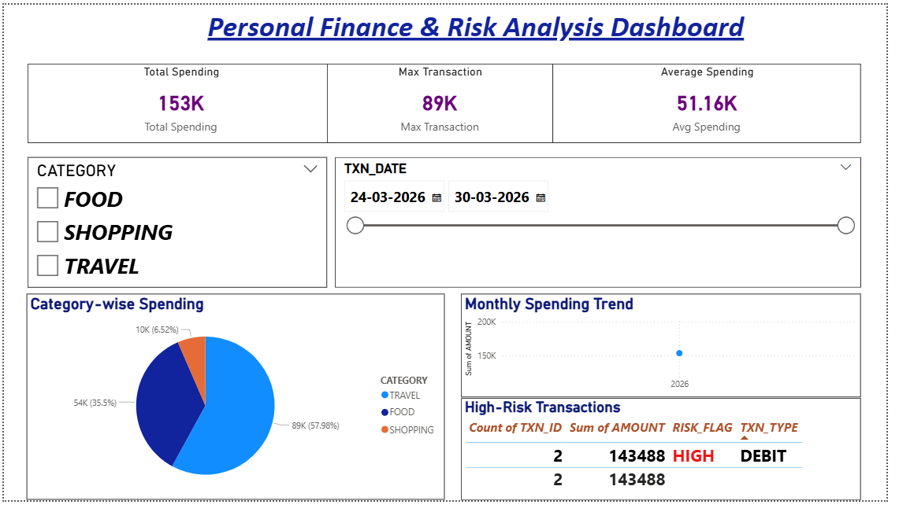

# 💰 Personal Finance & Risk Analysis System

## 📌 Project Overview
This project is a complete end-to-end **Finance Analysis System** built using multiple technologies to simulate real-world financial data processing and analysis.

It tracks user transactions, detects high-risk activities, and provides insightful analytics using dashboards.

---

## 🚀 Technologies Used

- Oracle SQL & PL/SQL
- Java (JDBC)
- Python (Pandas, oracledb)
- Power BI

---

## 🧠 Key Features

✔ Transaction Management System  
✔ High-Risk Transaction Detection  
✔ Category-wise Spending Analysis  
✔ Monthly Spending Trends  
✔ Interactive Power BI Dashboard

---

## 🏗️ Project Architecture

````
Database (Oracle)
↓
PL/SQL (Business Logic)
↓
Java (JDBC Backend)
↓
Python (Data Analysis)
↓
Power BI (Visualization)

````

---

## 📊 Dashboard Insights

- Total Spending, Max Transaction, Avg Spending
- Category-wise Spending Distribution
- Monthly Spending Trends
- High-Risk Transaction Identification

---

## 📂 Project Structure

````
│
├── java/ # JDBC-based backend code
├── python/ # Data analysis scripts
│ └── analysis.py
├── database/ # SQL & PL/SQL scripts
│ ├── schema.sql
│ └── sample_data.sql
├── powerbi/ # Dashboard files
│ ├── dashboard.pbix
│ └── dashboard.png  ()
├── README.md
└── .gitignore

````

---


---

## ⚙️ How to Run the Project

### 1️⃣ Setup Database
- Open Oracle SQL Developer
- Run scripts from `database/` folder:
    - Create tables
    - Insert sample data

---

### 2️⃣ Run Java Application
- Open project in IntelliJ IDEA
- Update database credentials in connection string
- Run main class:
   - EmployeeManagementSystem.java

---


### 3️⃣ Run Python Analysis
Install required libraries:
````
pip install pandas oracledb
````

Run script:
````
python analysis.py
````


---

### 4️⃣ Open Power BI Dashboard
- Open `powerbi/dashboard.pbix` in Power BI
- Interact with filters and visuals

---

## 🎯 Key Learnings

- Database design and normalization
- Writing optimized SQL queries
- Implementing business logic using PL/SQL
- Integrating database with Java using JDBC
- Performing data analysis using Python (Pandas)
- Creating interactive dashboards using Power BI

---

## 🎤 Highlight

> Built a full-stack Personal Finance & Risk Analysis System integrating Oracle SQL, PL/SQL, Java (JDBC), Python, and Power BI to manage transactions, detect risk patterns, and visualize financial insights through interactive dashboards.

---

## 👩‍💻 Author

**Urvi Patil**